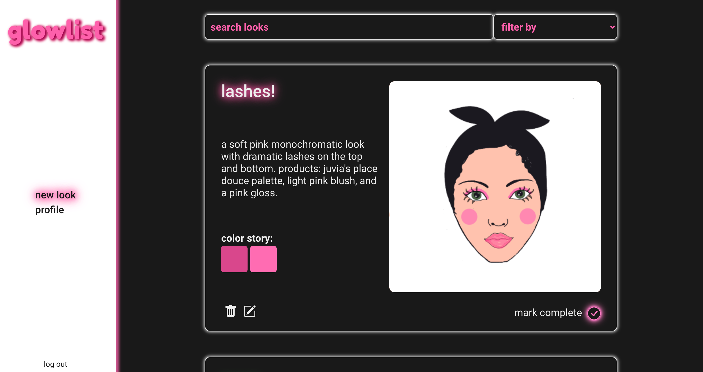

# glowlist #
by [Aleksa](https://github.com/aleksarad) 💗

Live at: [glowlist.netlify.app](https://glowlist.netlify.app/)

<kbd>
    
</kbd>

### Overview ###

Glowlist is an app for makeup enthusiasts to sketch out and store their makeup look ideas.

Glowlist allows a user to:
* Sign up and create an account
* Select a facechart and skintone that will serve as the backdrop for all their looks. This can be updated any time in their profile, allowing for one user to have a catalog of looks with many different facecharts and skintones.
* Create a makeup look by sketching on a facechart.
* View all their looks, edit their looks, and even mark them as complete once they've translated their sketch into a real life makeup application.
* Search through looks by name, and filter looks by completion.
* Log in/log-out & remain auto logged in after sign up/log in.

### Built With ###
* [Frontend](https://github.com/aleksarad/glowlist-frontend): React, React Bootstrap, React Canvas Draw, Sass, React Color
* [Backend](https://github.com/aleksarad/glowlist-backend): Ruby On Rails, PostgreSQL

### Features ###
* JWT Auth
* User account customization

### Improvements & Challenges ###
* Mobile Layout: While the media queries for mobile browsers render correctly in Chrome DevTools - the app's mobile appearance on an actual mobile device post deployment is less than ideal. Will be reworking how the app looks on smaller devices.
* Canvas responsiveness
* Would like to add different drawing brushes

### Resources used ###
* [Figma](https://www.figma.com/) - Creating mockups/prototypes for site layout and design
* [React-Canvas-Draw](https://github.com/embiem/react-canvas-draw) - A canvas drawing library for React
* [React-Color](https://casesandberg.github.io/react-color/) - A collection of React color pickers. Besides style and preference, the advantage of using React Color over an HTML color input is that React Color provides opacity options.

#### Thank you ####
Special thank you to [Tracy Shu](https://www.linkedin.com/in/tracy-shu-07354b48/) for helping me come up with the app name 💕
and thank you to [Anna Radevich](https://anna-radevich.herokuapp.com/) for the custom facecharts 💓

